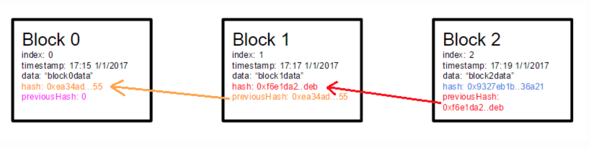

# Blockchain

A simple toy blockchain implementation.

## Overview

A blockchain can be thought of as a linked list, with the main difference being that the pointers from one block in the chain to the next block in the chain are hashes instead of simple references. 

## The Structure of a Block

A single block in the chain has the following properties:
 - **index**: The index of the block in the blockchain
 - **hash**: A SHA256 hash of every other field in the block
 - **previous hash**: The hash of the previous block in the chain
 - **timestamp**: The timestamp of when the block was created
 - **data**: The data that the block holds

Each block has a hash constructed in part from the previous hash. In other words, the hash of the latest block in the chain is constructed from the hashes of every previous block in the chain.

This is how blockchains maintain the integrity of the entire chain. If any block in the middle of the chain has its contents updated, every other block in the chain after the updated block will need to be updated accordingly, otherwise their hashes will no longer be valid. This is why blockchains are great for maintaining a sequence of transactions in a distributed fashion, among other use cases.

## What's Not in this Implementation (Yet)

Currently, this toy blockchain implementation is not capable of performing any [mining](https://en.bitcoin.it/wiki/Mining), as there is no [proof-of-work](https://en.wikipedia.org/wiki/Proof-of-work_system) problem to solve (yet). That will be the next step to implement as part of this data structure. 
