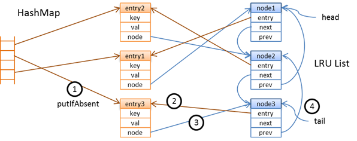

# LRU Cache

A simple LRU cache implementation that leverages Python's [OrderedDict](https://docs.python.org/3.7/library/collections.html#collections.OrderedDict) collection.

## Overview

An LRU cache is a type of software [cache](https://en.wikipedia.org/wiki/Cache_(computing)) that implements a simple cache invalidation strategy. Namely, once the cache reaches its maximum number of entries that it can store, in order to add the next entry, the entry that was accessed the longest time ago gets evicted in order to make room for the new entry. That new entry is added at the head of the cache, since it is the most-recently added entry.

Additionally, any time an entry that already exists in the cache is accessed, that entry is moved to the head of the cache. In this way, the cache keeps track of the order in which entries are added and accessed. 

## How an LRU Cache is Implemented

An LRU cache needs to juggle the following constraints:

 * Access times should be fast, since the whole point of caches is to fetch entries that they're storing.
 * Removing and updating should also be fast, since every time an entry is accessed, it needs to be removed from its place in the cache and then re-added.
 * The cache needs to be able to keep track of the order in which entries are added. 

A common way to implement LRU caches is to use a hash table for quick access and combine it with a doubly linked list, since the linked list can keep track of the order in which entries were added (e.g. the newest entry might go at the head of the list, while the oldest might go at the tail). 

However, with this particular toy implementation, the Python `collections` module includes a data structure called an `OrderedDict`, which is essentially what it sounds like: a dictionary that keeps track of the order in which entries are added to it. This makes it a pretty natural data structure upon which to implement an LRU cache. The biggest tradeoff though is the fact that the `OrderedDict` data structure does not come standard in other languages, so this particular implementation doesn't translate well to other language contexts. For other languages, you'll more likely need to go with the architecture prescribed above: utilizing a linked list in conjunction with a hash table. 